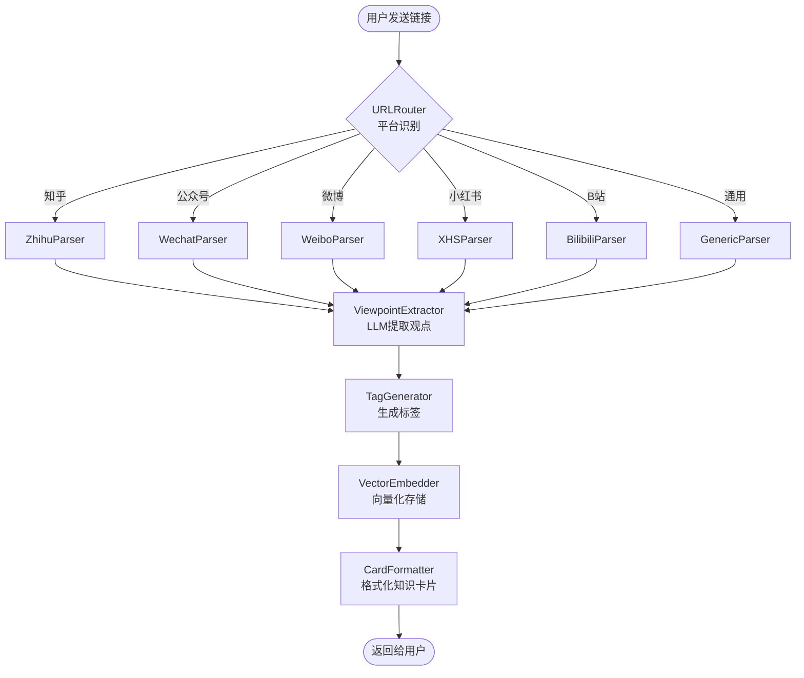

# MindFlow — 个人认知操作系统 · 设计规格

> **状态：** 已确认  
> **日期：** 2025-06-05  
> **目标：** 学习 LangChain + Function Calling + Memory，构建一个日常可用的个人知识 Agent  

---

## 1. 项目愿景

MindFlow 是一个**个人认知操作系统**。它帮助你收集碎片化的社交媒体阅读（知乎、公众号、微博、小红书、B站等），自动提取观点、打标签、建立知识关联，最终在正确的时机主动把知识推送到你面前。

核心交互极简：**你分享链接给它 → 它返回知识卡片 → 知识自动积累 → 需要时主动推送。**

---

## 2. 产品定义

### 2.1 一句话描述

> 把你每天刷到的各种内容，自动消化成你的「第二大脑」——可检索、可对比、可主动提醒。

### 2.2 核心功能（三阶段）

#### Phase 1 — Digest MVP（2 周）

| 功能 | 描述 |
|------|------|
| **多平台链接解析** | 识别知乎 / 微信公众号 / 微博 / 小红书 / B站 链接，自动抓取正文内容 |
| **智能观点提取** | LLM 提取核心观点、论证链、立场（支持/反对/中立） |
| **自动标签分类** | 生成 3-5 个标签，分类到预设领域 |
| **知识卡片回复** | 结构化 Markdown 卡片返回给用户 |
| **向量存储入库** | 存入 Chroma，支持后续语义检索 |
| **Telegram Bot 交互** | 用户通过 Telegram 发送链接和接收卡片 |

#### Phase 2 — 认知连接（+2 周）

| 功能 | 描述 |
|------|------|
| **相似观点匹配** | 新内容入库时自动找到已有知识库中相似的观点 |
| **矛盾观点识别** | 检测与新内容持相反立场的已有文章 |
| **知识图谱构建** | 观点之间的关系：支持/反对/补充/延伸 |
| **"与你已有知识的关联"** | 卡片中展示关联的历史文章 |

#### Phase 3 — 第二大脑（+2 周）

| 功能 | 描述 |
|------|------|
| **每日晨报** | 根据当天日程 + 近期收藏，推送可能相关的知识 |
| **上下文感知推送** | 检测用户当前场景，主动推送相关知识 |
| **认知问答** | "关于 XXX，各平台的主流观点分别是什么？" |
| **学习调度** | 标记想深入的主题，帮你在空闲时段安排阅读 |

### 2.3 暂不纳入的范围

- 主动全网爬取（仅解析用户主动分享的链接）
- 多用户支持
- Web UI 界面（Phase 1 仅 Telegram Bot）
- 商业化功能
- 视频/音频内容的完整转录（仅处理文本内容）

---

## 3. 技术架构

### 3.1 总体分层

```
┌─────────────────────────────────────────────┐
│              交互层: Telegram Bot             │
├─────────────────────────────────────────────┤
│         编排层: LangGraph Agent 工作流         │
│                                              │
│   DigestAgent    BrainAgent    PushAgent     │
│   (解析→提取)    (检索→对比)   (晨报→推送)     │
├─────────────────────────────────────────────┤
│         工具层: LangChain Tools               │
│                                              │
│   内容抓取  观点提取  向量检索  图谱查询       │
├─────────────────────────────────────────────┤
│         记忆层: 三层记忆系统                    │
│                                              │
│   短期记忆      长期偏好      知识图谱         │
│   (对话上下文)   (Mem0风格)    (NetworkX)      │
├─────────────────────────────────────────────┤
│         存储层                                │
│                                              │
│   Chroma(向量)  SQLite(元数据)  本地文件       │
└─────────────────────────────────────────────┘
```

### 3.2 技术选型

| 组件 | 技术选择 | 选型理由 |
|------|---------|---------|
| Agent 框架 | **LangGraph** | 有状态的多步骤工作流，天然支持 Checkpoint/Memory |
| LLM 工具调用 | **LangChain Tools + Function Calling** | 标准化 Tool 定义，自动生成 OpenAI function call schema |
| 向量数据库 | **Chroma** | 轻量、Python 原生、本地运行、零配置 |
| 长期记忆 | **LangGraph Checkpoint + SQLite** | 对话状态持久化 + 用户偏好存储 |
| 知识图谱 | **NetworkX**（Phase 2） | 纯 Python、轻量，后期可升级 Neo4j |
| LLM 服务 | **OpenAI 兼容 API** | 支持 DeepSeek / Qwen / GPT-4o-mini 等任意兼容服务 |
| 内容抓取 | **httpx + BeautifulSoup + Jina Reader** | 轻量优先，复杂场景用 Jina Reader 兜底 |
| 交互界面 | **python-telegram-bot** | 最轻量的日常交互方式 |
| 配置管理 | **python-dotenv + YAML** | 环境变量管理密钥，YAML 管理平台配置 |

### 3.3 为什么选 LangGraph 而不是纯 LangChain？

| LangChain | LangGraph |
|-----------|-----------|
| 适合线性链式调用 | 适合有分支、有状态、有循环的工作流 |
| 无原生状态管理 | 内置 Checkpoint 机制 → 天然即 Memory |
| 单步决策 | 多步决策 + 条件路由 + 人工介入点 |

MindFlow 的场景天然需要 LangGraph：解析平台 A 失败了 → 走兜底通用解析器；观点提取完成后 → 条件判断是否需要关联检索；用户反馈 → 影响后续推荐。这些都需要**有状态的图工作流**。

---

## 4. 数据模型

### 4.1 核心实体

```
Article（文章）
├── id: str (UUID)
├── url: str
├── platform: enum[zhihu, wechat, weibo, xiaohongshu, bilibili, generic]
├── title: str
├── author: str
├── raw_content: str          # 原始抓取文本
├── clean_content: str        # 清洗后的正文
├── summary: str              # LLM 生成摘要（200字内）
├── tags: list[str]           # 自动标签
├── stance: enum[support, oppose, neutral]  # 立场
├── extracted_at: datetime
└── source_metadata: dict     # 平台特有元数据

Viewpoint（观点）
├── id: str (UUID)
├── article_id: str (FK)
├── claim: str                # 核心论断
├── reasoning: str            # 论证链
├── evidence: list[str]       # 论据列表
├── confidence: float         # 提取置信度
└── created_at: datetime

KnowledgeRelation（知识关系）— Phase 2
├── source_id: str
├── target_id: str
├── relation_type: enum[supports, opposes, extends, complements]
├── description: str          # LLM 生成的关系说明
└── created_at: datetime

UserPreference（用户偏好）
├── key: str                  # 如 "interested_topics", "reading_level"
├── value: json
├── updated_at: datetime
```

### 4.2 存储映射

| 实体 | 主存储 | 索引 |
|------|--------|------|
| Article 元数据 | SQLite | url (UNIQUE), platform, extracted_at |
| Article 全文 | Chroma 向量集合 `articles` | 语义向量 |
| Viewpoint | SQLite + Chroma `viewpoints` | article_id, 语义向量 |
| KnowledgeRelation | NetworkX 图 + SQLite | source_id, target_id |
| UserPreference | SQLite `preferences` 表 | key (UNIQUE) |

---

## 5. LangGraph 工作流设计

### 5.1 Phase 1 — Digest 工作流



### 5.2 LangGraph State 定义

```python
class DigestState(TypedDict):
    # 输入
    url: str
    raw_content: Optional[str]
    
    # 平台识别结果
    platform: Optional[str]
    
    # 解析结果
    parsed_title: Optional[str]
    parsed_content: Optional[str]
    parse_error: Optional[str]
    
    # LLM 提取结果
    summary: Optional[str]
    viewpoints: Optional[list[dict]]
    tags: Optional[list[str]]
    stance: Optional[str]
    
    # 存储结果
    article_id: Optional[str]
    
    # 回复
    reply_card: Optional[str]
```

### 5.3 关键节点说明

| 节点 | 职责 | 输入 | 输出 | 使用 LLM？ |
|------|------|------|------|-----------|
| **URLRouter** | 识别平台类型 | url | platform | 否（规则匹配） |
| **Parser** | 抓取页面内容 | url, platform | parsed_content | 否 |
| **ViewpointExtractor** | 提取核心观点 | clean_content | viewpoints, stance | ✅ Function Calling |
| **TagGenerator** | 生成标签 | clean_content, viewpoints | tags | ✅ |
| **VectorEmbedder** | 向量化并存储 | 全部提取结果 | article_id | 否（Embedding 模型） |
| **CardFormatter** | 格式化知识卡片 | 全部结果 | reply_card | 否 |

---

## 6. Function Calling 设计

### 6.1 ViewpointExtractor 的 Function Call

```python
extract_viewpoint_tool = {
    "name": "extract_article_viewpoints",
    "description": "从文章中提取核心观点、论证链和立场",
    "parameters": {
        "type": "object",
        "properties": {
            "summary": {
                "type": "string",
                "description": "文章200字以内摘要"
            },
            "viewpoints": {
                "type": "array",
                "items": {
                    "type": "object",
                    "properties": {
                        "claim": {"type": "string", "description": "核心论断"},
                        "reasoning": {"type": "string", "description": "论证逻辑链"},
                        "evidence": {
                            "type": "array",
                            "items": {"type": "string"},
                            "description": "支撑论据"
                        }
                    },
                    "required": ["claim", "reasoning"]
                }
            },
            "stance": {
                "type": "string",
                "enum": ["support", "oppose", "neutral", "mixed"],
                "description": "文章整体立场"
            },
            "tags": {
                "type": "array",
                "items": {"type": "string"},
                "description": "3-5个标签，领域+主题",
                "minItems": 3,
                "maxItems": 5
            }
        },
        "required": ["summary", "viewpoints", "stance", "tags"]
    }
}
```

### 6.2 Phase 2 — 矛盾检测的 Function Call

```python
detect_contradiction_tool = {
    "name": "detect_viewpoint_contradictions",
    "description": "检测新文章观点与知识库中已有观点的矛盾/一致关系",
    "parameters": {
        "type": "object",
        "properties": {
            "relations": {
                "type": "array",
                "items": {
                    "type": "object",
                    "properties": {
                        "existing_article_id": {"type": "string"},
                        "relation": {
                            "type": "string",
                            "enum": ["supports", "opposes", "extends", "complements"]
                        },
                        "explanation": {"type": "string"}
                    }
                }
            }
        }
    }
}
```

---

## 7. Memory 系统设计

### 7.1 三层记忆架构

```
┌────────────────────────────────────────────┐
│  第一层：短期记忆（对话上下文）                │
│  实现：LangGraph Checkpoint                 │
│  内容：当前对话的状态、最近 N 轮交互           │
│  生命周期：单次会话                           │
│  示例：用户刚才发的那篇文章、上一轮的提问      │
├────────────────────────────────────────────┤
│  第二层：中期记忆（知识库）                    │
│  实现：Chroma 向量存储 + SQLite 元数据        │
│  内容：所有收藏文章、提取的观点、标签关系       │
│  生命周期：持久化                              │
│  示例："你收藏了 47 篇关于 AI 的文章"          │
├────────────────────────────────────────────┤
│  第三层：长期记忆（用户模型）                   │
│  实现：SQLite preferences + LangGraph 长期   │
│  内容：兴趣演化、阅读偏好、立场倾向、认知盲区    │
│  生命周期：持久化 + 持续更新                    │
│  示例："你对 AI Agent 的关注度在上升，           │
│         阅读偏好偏技术实现而非理论"             │
└────────────────────────────────────────────┘
```

### 7.2 长期记忆的自动更新策略

```
每次交互后自动更新:
  1. topic_affinity[tag] += 0.1        # 对相关主题的兴趣度增加
  2. last_read_timestamp = now()       # 记录最近阅读时间
  3. 如果用户说"这个有用/收藏/标记" → weight *= 1.5

每周一次离线更新:
  1. 统计各主题阅读量 → 生成兴趣热力图
  2. 识别未覆盖但相关的主题 → 认知盲区
  3. 更新 reading_level（根据内容难度分布）
```

---

## 8. 平台解析策略

### 8.1 URL 路由规则

| 平台 | URL 模式 | 解析策略 |
|------|---------|---------|
| 知乎 | `zhihu.com/question/*`, `zhuanlan.zhihu.com/*` | API优先 → HTML回退 |
| 微信公众号 | `mp.weixin.qq.com/s/*` | fetch-skill 方案 |
| 微博 | `weibo.com/*`, `m.weibo.cn/*` | 移动端页面解析 |
| 小红书 | `xhslink.com/*`, `xiaohongshu.com/*` | Cookie认证解析 |
| B站 | `bilibili.com/read/*`, `bilibili.com/video/*` | API + 视频简介 |
| 通用 | 其他 URL | Jina Reader 兜底 |

### 8.2 解析器接口

```python
class BaseParser(ABC):
    """所有平台解析器的基类"""
    
    @abstractmethod
    def can_parse(self, url: str) -> bool: ...

    @abstractmethod
    async def parse(self, url: str) -> ParsedArticle:
        """返回统一的 ParsedArticle 结构"""
        ...

class ParsedArticle:
    title: str
    author: str
    content: str          # 清洗后的文本
    platform: str
    metadata: dict        # 平台特有字段
    parse_method: str     # 记录用了哪种解析方式，方便调试
```

### 8.3 兜底策略

```
尝试顺序:
1. 平台专用解析器（最佳效果）
2. Jina Reader (r.jina.ai/{url})（通用但可能不完整）
3. 通用 HTML 提取（BeautifulSoup + readability-lxml）
4. 失败 → 返回错误卡片，提示用户手动粘贴内容
```

---

## 9. 项目目录结构

```
mindflow/
├── src/
│   ├── __init__.py
│   ├── config.py                 # 配置加载（环境变量 + YAML）
│   │
│   ├── agents/                   # LangGraph Agent 定义
│   │   ├── __init__.py
│   │   ├── digest/               # Phase 1: Digest Agent
│   │   │   ├── __init__.py
│   │   │   ├── graph.py          # LangGraph 图定义
│   │   │   ├── state.py          # State 类型定义
│   │   │   └── nodes.py          # 各节点实现
│   │   └── brain/                # Phase 2-3: Brain Agent
│   │       └── __init__.py
│   │
│   ├── parsers/                  # 各平台内容解析器
│   │   ├── __init__.py
│   │   ├── base.py               # BaseParser 抽象类
│   │   ├── router.py             # URLRouter 路由逻辑
│   │   ├── zhihu.py
│   │   ├── wechat.py
│   │   ├── weibo.py
│   │   ├── xiaohongshu.py
│   │   ├── bilibili.py
│   │   └── generic.py            # 通用解析器（含 Jina Reader）
│   │
│   ├── memory/                   # 记忆系统
│   │   ├── __init__.py
│   │   ├── vector_store.py       # Chroma 操作封装
│   │   ├── metadata_store.py     # SQLite 元数据 CRUD
│   │   ├── preference.py         # 用户偏好管理
│   │   └── graph_store.py        # Phase 2: NetworkX 知识图谱
│   │
│   ├── tools/                    # LangChain Function Calling Tools
│   │   ├── __init__.py
│   │   ├── extract_viewpoint.py  # 观点提取 Tool
│   │   ├── generate_tags.py      # 标签生成 Tool
│   │   ├── search_similar.py     # Phase 2: 相似检索 Tool
│   │   └── detect_contradict.py  # Phase 2: 矛盾检测 Tool
│   │
│   ├── bot/                      # Telegram Bot
│   │   ├── __init__.py
│   │   ├── main.py               # Bot 入口
│   │   └── handlers.py           # 消息处理
│   │
│   └── llm/                      # LLM 封装
│       ├── __init__.py
│       └── client.py             # 统一的 LLM 调用接口
│
├── tests/                        # 测试
│   ├── test_parsers/
│   ├── test_agents/
│   └── test_memory/
│
├── data/                         # 本地数据（gitignore）
│   ├── chroma/                   # Chroma 持久化目录
│   └── mindflow.db               # SQLite 数据库
│
├── docs/
│   └── superpowers/
│       └── specs/
│           └── 2025-06-05-mindflow-design.md  # 本文件
│
├── .env.example                  # 环境变量模板
├── .gitignore
├── requirements.txt
└── README.md
```

---

## 10. 学习路径映射

每个模块对应你要学习的技术：

| 模块 | LangChain | Function Calling | Memory |
|------|:--:|:--:|:--:|
| `parsers/router.py` | — | ✅ URL 路由决策 | — |
| `tools/extract_viewpoint.py` | ✅ Tool 定义 | ✅ 结构化输出 | — |
| `agents/digest/graph.py` | ✅ LangGraph 图 | — | ✅ Checkpoint |
| `agents/digest/nodes.py` | ✅ Chain 组合 | ✅ Tool 绑定 | — |
| `memory/vector_store.py` | ✅ VectorStore 集成 | — | ✅ 中期记忆 |
| `memory/preference.py` | — | — | ✅ 长期记忆 |
| `bot/handlers.py` | — | — | ✅ 会话上下文 |

---

## 11. 关键设计决策记录

### 11.1 为什么先从 Telegram Bot 开始？
- 最轻量的交互方式，不需要写前端
- 日常高频使用场景（手机上刷到好内容 → 直接转发给 Bot）
- python-telegram-bot 库成熟稳定
- Phase 3 可以在此基础上加 Web UI

### 11.2 为什么内容抓取不用 LangChain 的 WebBaseLoader？
- 国内平台（微信、知乎、小红书）需要专门的解析策略
- LangChain 内置 Loader 对中文平台支持有限
- 自定义 Parser 本身就是很好的学习机会（请求处理、错误重试、内容清洗）

### 11.3 为什么用 Chroma 而不是 Pinecone/Weaviate？
- 本地运行，零成本
- Python 原生，学习曲线低
- 数据量不大（个人知识库，不是百万级文档）
- 后期需要扩展时可以无缝迁移到其他向量库

### 11.4 为什么 Phase 1 不做知识图谱？
- 先跑通核心流程（解析 → 提取 → 存储 → 回复）
- 知识图谱需要一定的数据积累才有意义
- NetworkX 的学习成本在 Phase 1 之后单独攻克更高效

---

## 12. 成功标准

### Phase 1 完成标准
- [ ] 用户通过 Telegram 发送链接 → 30 秒内返回知识卡片
- [ ] 支持知乎、微信公众号两种平台（最低），争取 5 种
- [ ] 卡片包含：摘要、核心观点、立场、标签
- [ ] 解析失败时有友好的错误提示
- [ ] 所有内容持久化到 Chroma + SQLite

### Phase 2 完成标准
- [ ] 新内容入库时自动显示 1-3 条关联的历史文章
- [ ] 能识别并标注矛盾/一致关系
- [ ] "关于 XXX，帮我总结各方观点" 的问答能力

### Phase 3 完成标准
- [ ] 每天早上 8:00 推送个性化晨报
- [ ] "本周你读了 X 篇关于 Y 的文章" 的回顾能力
- [ ] 根据你的兴趣演化推荐未覆盖的主题

---

*本规格文档将作为后续所有开发工作的唯一事实来源。任何实现层面的歧义，均以本文档为准。*
